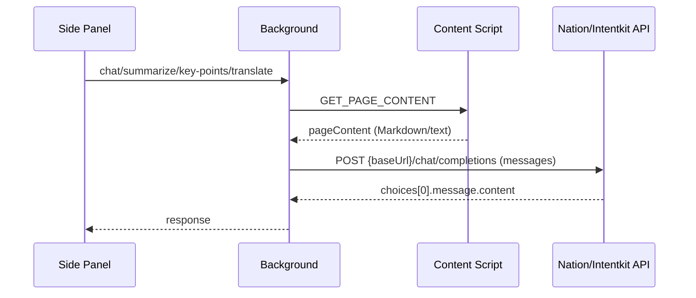

## Nation/Intentkit API – minimal flow

### What to configure
- **API Key**: `crestalApiKey` (Options page)
- **Base URL**: `apiBaseUrl` (set to Intentkit/Nation-compatible endpoint)

### Where things live
- **Requests**: `services/llm-service.js` (`makeRequest`, `chatWithPage`, `summarizePage`, `listKeyPoints`, `translateText`)
- **Coordination**: `background.js` (injects content script, calls LLM, returns result)
- **UI messaging**: `sidepanel/api.js` (sends message to background, renders reply)
- **Extraction**: `content.mjs` (Readability + Turndown → Markdown/text)

### Request shape (OpenAI-compatible)
- POST `{baseUrl}/chat/completions`
- Headers: `Authorization: Bearer <key>`, `Content-Type: application/json`
- Body: `{ model, messages, max_tokens, temperature }`

Tip: Switch providers by changing `apiBaseUrl` in Options; the message schema stays the same.

