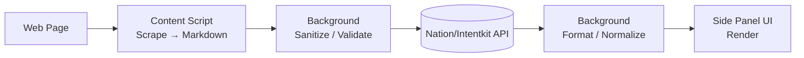

## Intentkit/Nation API demo (minimal)

### Key steps
- **Scrape**: The content script extracts readable content (Readability) and converts to Markdown (Turndown), with length limits.
- **Sanitize**: Content is normalized and truncated to safe size; UI input is validated before sending.
- **Send**: Background posts a Chat Completions request to the configured base URL with Bearer auth.
- **Receive & format**: The response text is returned; when structured JSON is detected, it’s formatted for display.

### Configure
- **API Key**: `crestalApiKey` (Options)
- **Base URL**: `apiBaseUrl` (set your Intentkit/Nation-compatible endpoint)

### Request (OpenAI-compatible)
- POST `{baseUrl}/chat/completions` with `{ model, messages, max_tokens, temperature }`

